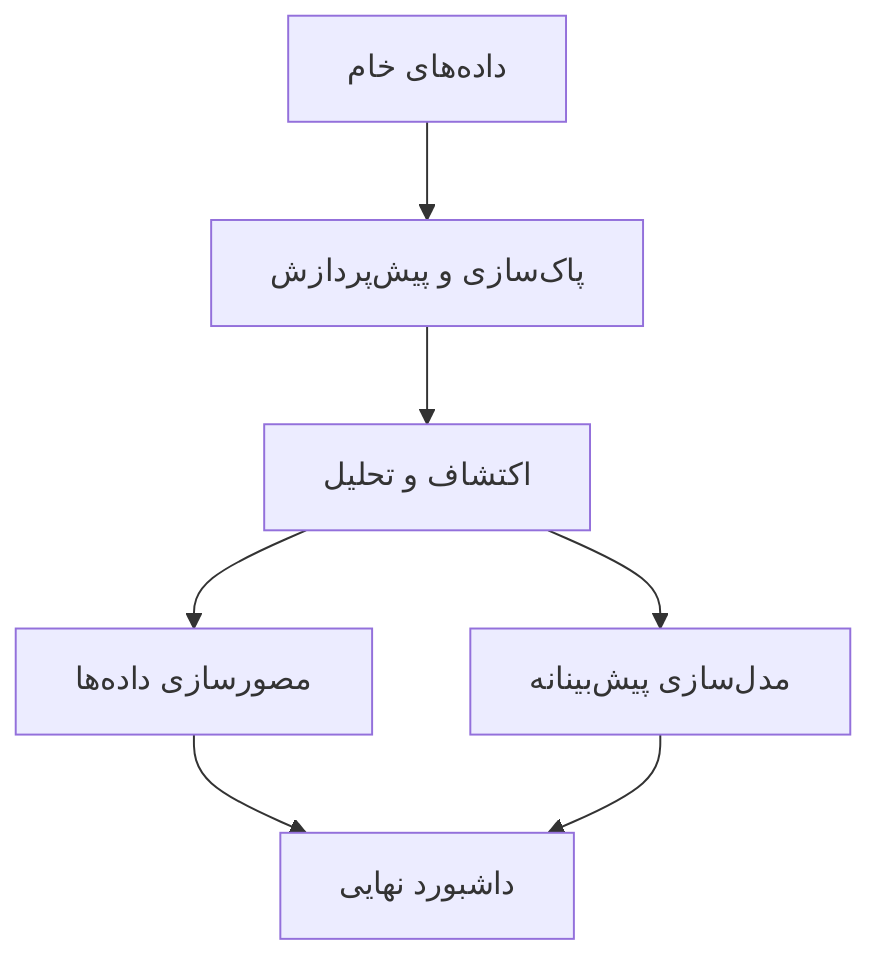

# 🎬 تحلیل داده فیلم‌های انیمیشن

## 📊 پروژه تحلیل داده فیلم‌های انیمیشن با پایتون


## 📋 معرفی پروژه

این پروژه یک تحلیل جامع از داده‌های فیلم‌های انیمیشن انجام می‌دهد که شامل مراحل زیر است:



## 📁 مجموعه داده

داده‌های مورد استفاده در این پروژه از فایل `Animation_Movies.csv` بارگذاری می‌شوند.

**ستون‌های موجود در داده‌ها:**
- `Title`: عنوان فیلم
- `Year`: سال انتشار
- `Rating`: امتیاز فیلم
- `Votes`: تعداد رأی‌دهندگان
- `Genre`: ژانر فیلم
- `Runtime`: مدت زمان فیلم
- `Budget`: بودجه تولید
- `Revenue`: درآمد فروش
- `Studio`: استودیوی تولید کننده

## 🛠️ فناوری‌های مورد استفاده

```python
import pandas as pd
import numpy as np
import matplotlib.pyplot as plt
import seaborn as sns
from sklearn.model_selection import train_test_split
from sklearn.preprocessing import StandardScaler
from sklearn.ensemble import RandomForestRegressor, RandomForestClassifier
from sklearn.metrics import mean_squared_error, r2_score, accuracy_score
```

## 📊 مراحل تحلیل

### 1. اکتشاف اولیه داده‌ها
- بررسی ابعاد داده‌ها
- بررسی مقادیر缺失
- آمار توصیفی متغیرهای عددی و категоوری

### 2. پاک‌سازی و پیش‌پردازش
- مدیریت مقادیر缺失 (عددی با میانه، категоوری با مد)
- حذف داده‌های تکراری
- استانداردسازی فرمت داده‌ها

### 3. تحلیل اکتشافی (EDA)
- **تحلیل زمانی:** روند تولید فیلم‌ها در سال‌های مختلف
- **تحلیل ژانرها:** پراکندگی ژانرهای مختلف
- **تحلیل استودیوها:** پرکارترین استودیوها
- **تحلیل موفقیت:** رابطه بین امتیاز، بودجه و درآمد

### 4. مهندسی ویژگی
- ایجاد ویژگی‌های جدید:
  - `Profit`: سود = درآمد - بودجه
  - `ROI`: بازگشت سرمایه
  - `Decade`: دهه تولید اثر
  - ویژگی‌های دودویی برای ژانرهای مختلف

### 5. مدل‌سازی پیش‌بینانه
- **رگرسیون:** پیش‌بینی امتیاز فیلم
- **طبقه‌بندی:** پیش‌بینی موفقیت فیلم
- **ارزیابی مدل:** دقت، RMSE و R-squared

## 📈 یافته‌های کلیدی

### 1. تحلیل زمانی
- روند تولید فیلم‌های انیمیشن در سال‌های مختلف
- تغییرات میانگین امتیازها در طول زمان

### 2. تحلیل ژانرها
- ژانرهای پرتکرار در فیلم‌های انیمیشن
- رابطه بین ژانر و امتیاز/درآمد

### 3. تحلیل مالی
- رابطه بین بودجه و درآمد
- محاسبه سود و بازگشت سرمایه
- شناسایی فیلم‌های پرفروش و پر سود

### 4. همبستگی متغیرها
- بررسی رابطه بین امتیاز، تعداد آراء، بودجه و درآمد
- ماتریس همبستگی بین متغیرهای عددی

## 🚀 نحوه اجرای پروژه

1. **نصب prerequisites:**
```bash
pip install pandas numpy matplotlib seaborn scikit-learn
```

2. **اجرای تحلیل کامل:**
```python
python animation_analysis.py
```

3. **اجرای مرحله به مرحله در ژوپیتر:**
```bash
jupyter notebook
```

## 📂 ساختار پروژه

```
پروژه-تحلیل-انیمیشن/
├── data/
│   └── Animation_Movies.csv
├── notebooks/
│   ├── 01_اکتشاف_داده.ipynb
│   ├── 02_پاک‌سازی_داده.ipynb
│   └── 03_تحلیل_و_مدل‌سازی.ipynb
├── scripts/
│   └── animation_analysis.py
├── results/
│   ├── figures/
│   └── reports/
└── README.md
```

## 💡 کاربردهای عملی

- **برای استودیوهای فیلم‌سازی:** شناسایی عوامل موفقیت فیلم‌ها
- **برای سرمایه‌گذاران:** ارزیابی ریسک و بازگشت سرمایه
- **برای فیلم‌سازان:** درک ترندهای محبوب و مخاطبان

## 📝 نتیجه‌گیری

این پروژه نشان می‌دهد که با استفاده از تحلیل داده می‌توان:
- عوامل مؤثر بر موفقیت فیلم‌ها را شناسایی کرد
- روندهای صنعت انیمیشن را تحلیل کرد
- مدل‌های پیش‌بینانه برای موفقیت فیلم‌ها ایجاد کرد

---
